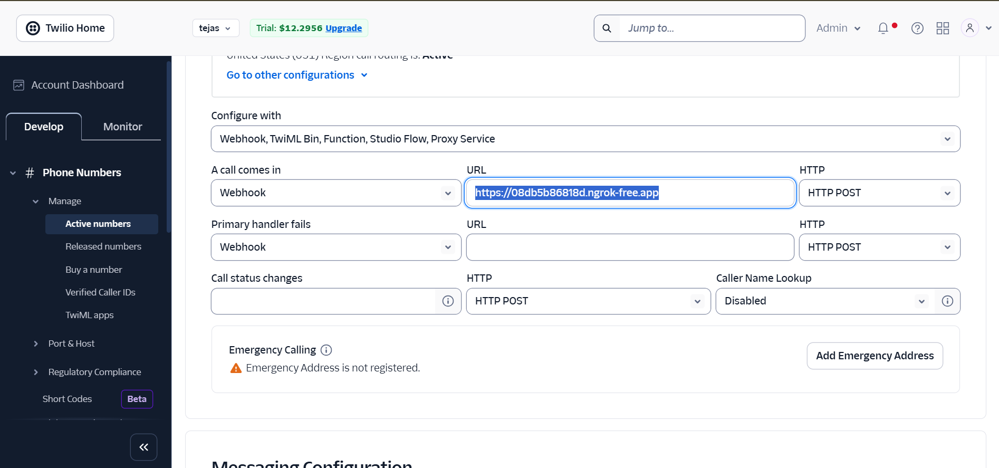

# 📞 AI-Powered Voice Call Service with Twilio, Flask, and Ngrok

This project demonstrates how to build a Flask-based telemedicine/voice assistant service powered by **Twilio**, **Ngrok**, and AI agents (Gemini or Groq). It allows you to automatically initiate phone calls, capture speech, and play AI-generated responses.

---

## 🚀 Setup Instructions

### 1. Clone the Project
```bash
git clone https://github.com/tejas-130704/MultiLingual_Rural_Support.git
cd MultiLingual_Rural_Support
````

---

### 2. Create Virtual Environment (Python 3.12)

```bash
# Create venv with Python 3.12
python3.12 -m venv venv

# Activate venv
# On Linux / macOS
source venv/bin/activate

# On Windows
venv\Scripts\activate
```

---

### 3. Install Dependencies

```bash
pip install -r requirements.txt
```

> Make sure you also install **ngrok v3** from [ngrok.com](https://ngrok.com/download).

---

### 4. Twilio Setup

1. Create a free account at [Twilio](https://www.twilio.com/).
2. Get your:

   * **Account SID**
   * **Auth Token**
   * **Twilio Phone Number** (international number assigned by Twilio).
3. ⚠️ Twilio phone numbers are **international numbers**. Calling local numbers may require **international calling charges**.

   * For testing, we make calls **from the server** to a **target phone number** that you provide.
   * Update `.env` with your own target phone (your mobile number).

---

### 5. Create `.env` File

Inside the project root, create a `.env` file with the following contents:

```env

GOOGLE_API_KEY=REPLACE_ME_GOOGLE_API_KEY
GROQ_API_KEY=REPLACE_ME_GROQ_API_KEY
NGROK_HOST=https://your-ngrok-url.ngrok-free.app
SECRET_KEY=REPLACE_ME_SECRET_KEY
ACCOUNT_SID=REPLACE_ME_TWILIO_ACCOUNT_SID
AUTH_TOKEN=REPLACE_ME_TWILIO_AUTH_TOKEN
TWILIO_PHONE=+10000000000
TARGET_PHONE=+19999999999

PORT=5000

PORT=5000
```

* Replace `ACCOUNT_SID`, `AUTH_TOKEN`, and `TWILIO_PHONE` with values from your Twilio dashboard.
* Replace `TARGET_PHONE` with the number you want to call (e.g., your own mobile number).

---

### 6. Ngrok Setup

Start your Flask service on port `5000`:

```bash
python app.py
```

In another terminal, start ngrok:

```bash
ngrok http 5000
```

Copy the HTTPS forwarding URL (e.g., `https://xxxx.ngrok-free.app`) and update it in your `.env` file under:

```env
NGROK_HOST=https://xxxx.ngrok-free.app
```

---

### 7. Configure Twilio with Ngrok URL

1. Go to **Twilio Dashboard → Develop → Phone Numbers → Manage → Active Numbers**. at [Click here](https://console.twilio.com/us1/develop/phone-numbers/manage/incoming)
2. Click on your Twilio number.
3. Scroll down to **Voice Configuration → A Call Comes In**.
4. Paste your ngrok URL, for example:


   ```
   https://xxxx.ngrok-free.app
   ```




5. Click **Save Configuration**.

---

### 8. Run the Call

Finally, initiate a call to the target phone:

```bash
python apicall.py
```

You should receive a call on your phone, and Twilio will handle the interactive voice response via Flask.

---

## 🔑 API Keys & Agents

* The project supports two AI agents:

  * **Gemini** (Google Generative AI, requires `GOOGLE_API_KEY`)
  * **Groq** (requires `GROQ_API_KEY`)
* Add the keys you need in `.env`.
* Modify the code to select which agent you want to use.

---

## ✅ Summary

* Virtual environment: **Python 3.12**
* Tunnels: **Ngrok v3**
* Voice calls: **Twilio** (international)
* Config: **`.env` file**
* Flask app serves Twilio TwiML for voice flow

---

💡 Now you’re ready to make AI-powered calls using Flask, Twilio, and Ngrok!


